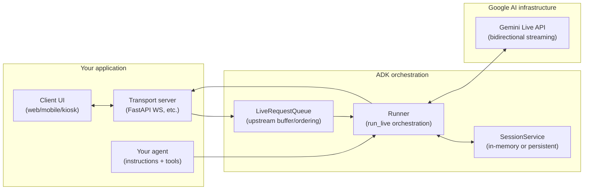
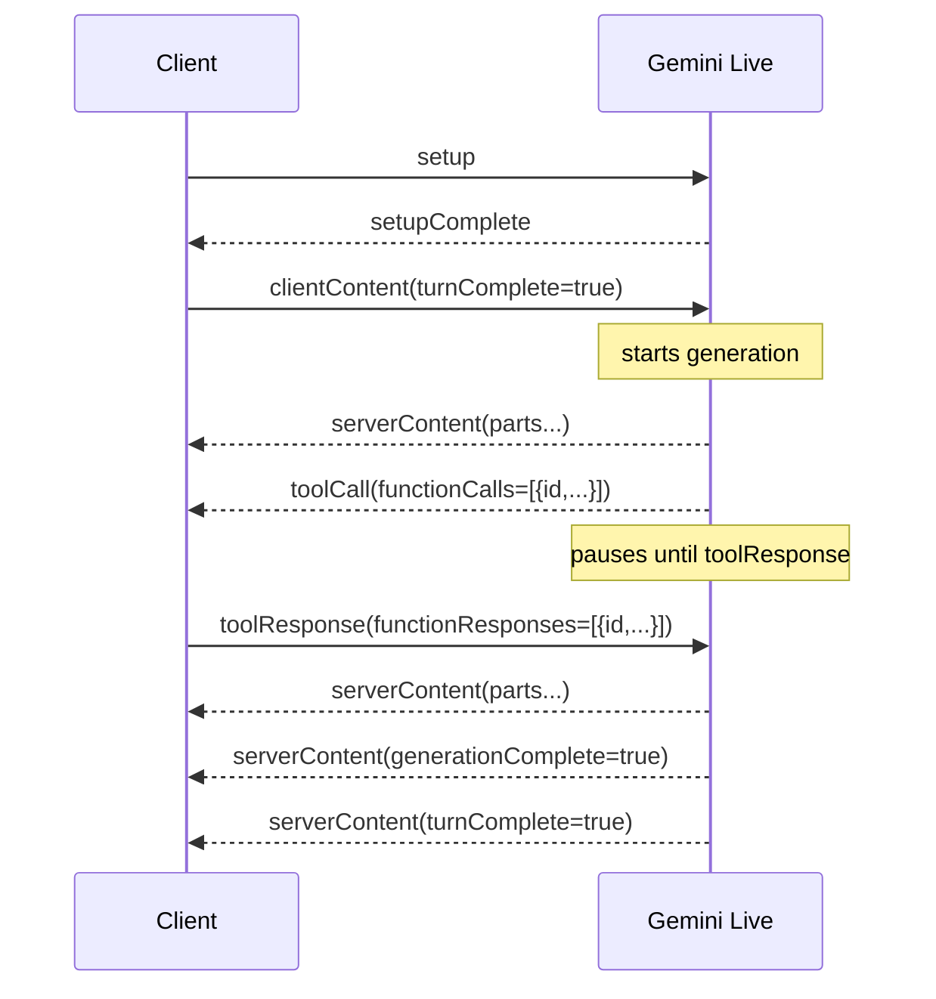
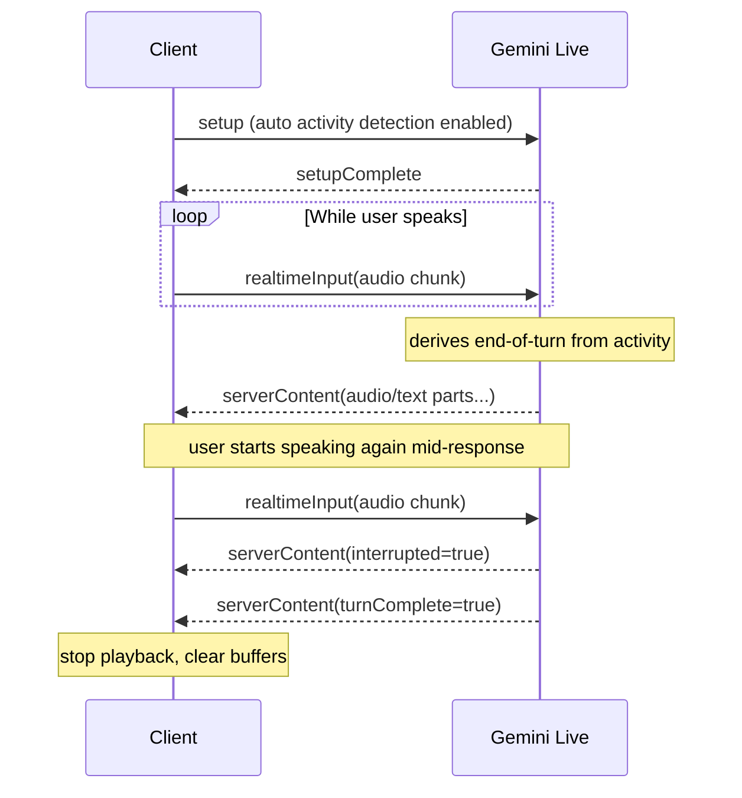
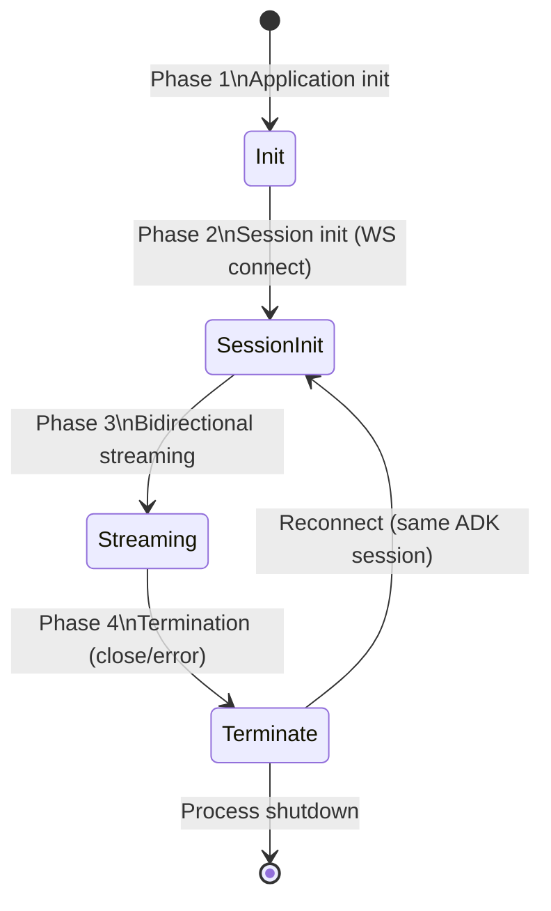
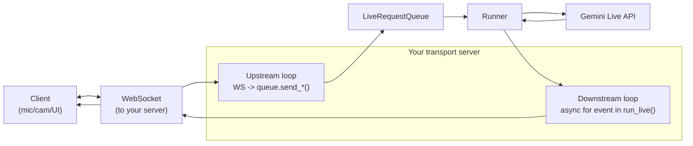
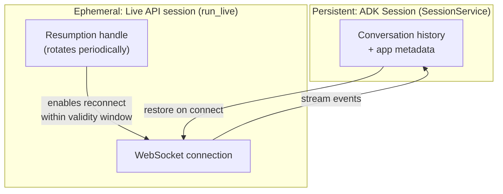

# Google Gemini Live API (+ ADK toolkit) — streaming semantics, tool calls, and sessions

> **Scope:** Gemini API Live (ai.google.dev) over WebSockets, plus the ADK Gemini Live “AI Toolkit” abstractions (Runner, SessionService, LiveRequestQueue).
>
> **Why this doc exists:** Real-time voice/video is not “call model, await answer”. It’s a full‑duplex event protocol with explicit turn boundaries, interruption, tool calls, and session/connection lifetimes. ADK can hide much of the plumbing, but the underlying semantics still matter.
>
> **Last reviewed:** 2026-03-03 (docs “last updated” dates referenced below vary by page).

## Key terms (use these consistently)

- **Connection**: the underlying WebSocket transport.
- **Session**: the Live API conversation bound to a connection (and optionally resumable across connections).
- **Turn**: a unit of model response, ending when the server sends `turnComplete=true`.
- **Streaming input**: continuous `realtimeInput` (audio/video/text) that the server processes incrementally.
- **Turn-based input**: discrete `clientContent` that you explicitly end with `turnComplete=true`.
- **Event stream**: server messages you receive asynchronously (`serverContent`, `toolCall`, `goAway`, etc.).

## Mental model (one picture)

Think of Live as **two independent, always-on pipes**:

- **Upstream (client → server):** you can send `realtimeInput`, `clientContent`, and `toolResponse` at any time.
- **Downstream (server → client):** the model streams `serverContent` chunks; may emit `toolCall`; may emit lifecycle events like `goAway` or `sessionResumptionUpdate`.

Your implementation should look like a small **event-driven runtime** (multiple async tasks), not “call model; await answer”.

## ADK toolkit mental model (how it maps onto Live)

If you use ADK’s Gemini Live toolkit, your architecture typically becomes:



**What changes vs raw Live API:**

- You still have a WebSocket, audio/video streaming, interruptions, and tool calls.
- But ADK gives you **a queue** (upstream), **typed events** (downstream), and **session persistence** via `SessionService`, so you don’t hand-roll protocol glue.

## Why ADK vs raw Live API (what it removes)

Raw Live API is powerful, but it pushes a lot of application plumbing onto you (protocol translation, reconnection/resumption, event typing, persistence, and tool execution choreography).

ADK’s “Gemini Live toolkit” positions itself as a reduction layer:

- **Upstream ordering/buffering:** `LiveRequestQueue` absorbs bursty client input and sequences it.
- **Downstream typing:** events arrive as typed models (Pydantic), so you can serialize/forward them directly.
- **Tool execution:** tool calls can be executed automatically (your code observes tool call/response events rather than manually wiring `toolResponse`).
- **Session persistence:** `SessionService` provides in-memory and persistent stores for long-lived chat history.
- **Protocol glue:** ADK hides raw message shapes (`clientContent` / `realtimeInput` / `serverContent`) behind higher-level APIs.

You still need to understand Live semantics (turn boundaries, interruption, resumption/compression), because they are **observable in the UX** even if ADK abstracts the transport.

## Transport & concurrency: async vs sync (what is guaranteed?)

### WebSocket-level ordering (what you can rely on)

- Each direction is ordered by the underlying connection (messages arrive in the order they were sent on that direction).
- But the protocol itself is **full‑duplex**: the server can keep sending while you keep sending. Design your client as concurrent loops.

### Live protocol-level ordering (what you cannot rely on)

- `realtimeInput` modalities (audio/video/text) are “concurrent streams” and **cross-stream ordering is not guaranteed**.
- Transcriptions (`inputTranscription` / `outputTranscription`) are sent **independently** and have **no guaranteed ordering** relative to `serverContent` or each other.
- If you interleave `clientContent` and `realtimeInput`, the server “attempts to optimize” for best response, but there are **no guarantees** about how they’re combined.

If you need strict alignment (e.g., text markers aligned to audio frames), add your own timestamps/sequence numbers at the app layer.

## Message types (what you send vs what you receive)

### Client → server (you send exactly one of these per WS message)

| Field | Purpose | Important semantics |
|---|---|---|
| `setup` | First message; configures model, generation config, tools, VAD, resumption, compression | **Send once**, then wait for `setupComplete` before anything else. |
| `clientContent` | Discrete turn-based content appended to the conversation history | **Interrupts any current model generation.** Generation starts only when `turnComplete=true`. |
| `realtimeInput` | Continuous audio/video/text streams | End-of-turn is **derived from user activity** (e.g., end of speech). Input is processed **incrementally even before end-of-turn**. |
| `toolResponse` | Your response to a server `toolCall` | Match responses to calls by `id`. |

### Server → client (event stream you must handle)

| Field | What it means | Practical handling |
|---|---|---|
| `setupComplete` | Server accepted the `setup` config | Start normal send/receive loops only after this. |
| `serverContent` | Streaming model output + turn state | Stream parts, handle `generationComplete`, `turnComplete`, and `interrupted`. |
| `toolCall` | Model requests function calls | Execute functions and reply with `toolResponse`. |
| `toolCallCancellation` | Previously issued tool calls should be cancelled/ignored | Happens when the client interrupts server turns; stop any in-flight side effects if possible. |
| `sessionResumptionUpdate` | New resumption handle is available (if enabled) | Persist `newHandle` when `resumable=true`. |
| `goAway` | Server will disconnect soon | Use `timeLeft` to reconnect cleanly. |
| `usageMetadata` | Token accounting (may appear alongside other server messages) | Includes `thoughtsTokenCount` for thinking models (count only). |

## When does the model “start thinking”?

There is **no separate, ordered “thought stream”** in Live. What you observe is:

- The server begins producing `serverContent` when it decides to respond (turn-based: after you end the turn; realtime: after activity-derived end-of-turn).
- Some models report **how many “thought tokens” were used** in `usageMetadata.thoughtsTokenCount`, but the Live API does **not** stream raw internal reasoning as a separate channel.

Practically:

- With **turn-based input (`clientContent`)**: the server will not start generating until you explicitly end the turn (`turnComplete=true`).
- With **streaming input (`realtimeInput`)**: the server processes input incrementally as it arrives to reduce latency, and end-of-turn is inferred from activity (or signaled manually if auto activity detection is disabled).

## Generation lifecycle flags you must understand

Within `serverContent`:

- `generationComplete=true`: the model is **done generating** tokens for this turn.
  - If the model is interrupted, you may **never** see `generationComplete` for that turn.
  - There may be a delay between `generationComplete` and `turnComplete` if the model assumes real-time playback.
- `turnComplete=true`: the model finished the turn and will only start again after additional client messages.
- `interrupted=true`: a client message (or activity) interrupted the current generation; if you’re playing audio, **stop and clear your playback queue**.

## Tool calls: when they happen, and how they interleave

### The essential rule

Tool calls are part of the **server → client event stream**. The model “decides” to call a tool during generation and emits a `toolCall` message. Your application runs the function and replies with `toolResponse` (matching `id`s). Then the model continues.

### Blocking (default) vs non-blocking tools

- **Default behavior is blocking/sequential**: the conversation pauses while tool results are outstanding (you can’t keep interacting normally).
- You can declare a function as **non-blocking** by setting `behavior: NON_BLOCKING` in the function definition.
- For non-blocking functions, you can control how the model reacts to results via a `scheduling` parameter in the `FunctionResponse`:
  - `INTERRUPT`: interrupt current work and surface the tool result immediately
  - `WHEN_IDLE`: wait until the model is idle
  - `SILENT`: don’t surface; use later implicitly

### Time sequence diagrams

#### A) Turn-based text (clientContent) with a blocking tool call



#### B) Streaming mic audio (realtimeInput) with barge-in interruption



#### C) Non-blocking tool call (conversation continues)

```mermaid
sequenceDiagram
  participant C as Client
  participant S as Gemini Live

  C->>S: setup(tools include NON_BLOCKING fn)
  S-->>C: setupComplete

  C->>S: clientContent(turnComplete=true)
  S-->>C: toolCall(id=1, NON_BLOCKING)
  Note over S: continues generating; client can keep sending input
  S-->>C: serverContent(parts...)

  C->>S: toolResponse(id=1, scheduling=WHEN_IDLE)
  Note over S: incorporates when idle (or interrupts if INTERRUPT)
  S-->>C: serverContent(parts... possibly referencing tool result)
```

## Sessions: lifetimes, compression, and resumption

### Lifetimes you must plan for

The Live API doc distinguishes:

- **Session lifetime** (without compression): ~15 minutes (audio-only) or ~2 minutes (audio+video).
- **Connection lifetime**: also limited (doc says ~10 minutes).

If you exceed limits, the connection is terminated and the session ends unless you proactively mitigate.

### Context window compression (for “infinite” sessions)

Enable `contextWindowCompression` in `setup`:

- Uses a configurable mechanism (e.g., sliding window) to reduce context size when it exceeds a threshold.
- Compression has tradeoffs: it can cause a temporary latency spike, and it discards earlier context (sliding window keeps system instructions and begins at a user turn boundary).

### Session resumption (keep a session alive across connections)

Enable `sessionResumption` in `setup`:

- The server will periodically send `sessionResumptionUpdate` messages.
- When `resumable=true` and `newHandle` is present, persist it (associate it with the logical session in your app).
- If the connection drops (or you receive `goAway`), reconnect and pass the last saved handle as `sessionResumption.handle` to continue the session.
- Resumption handles are valid for **~2 hours after session termination** (treat them as short‑lived).
- On resume, you can update most config fields, but you **cannot change the model**.
- Resumption is **not** always possible (e.g., during generation or tool execution). In those windows, updates can be `resumable=false` and `newHandle` empty; attempting resumption from that point may lose data.

### `goAway` (disconnect warning)

The server may send `goAway` with `timeLeft` indicating how long before the connection will be terminated. Use it to:

- stop starting new work that can’t finish,
- persist the latest resumable handle,
- reconnect before hard termination.

## ADK lifecycle: four phases (process vs per-connection)

An ADK Gemini Live toolkit app is easiest to keep correct if you enforce this lifecycle:



### Phase 1 — Application initialization (once per process)

- Define your **Agent** (model + instructions + tools).
- Create a **SessionService**:
  - in-memory for dev
  - persistent store (SQL/managed) for production
- Create a **Runner** that will manage many concurrent user sessions.

Design intent: these objects should be **stateless and reusable**; per-user state lives in sessions, not in singleton globals.

### Phase 2 — Session initialization (once per WebSocket connection)

- Identify the user (`user_id`) and the conversation (`session_id`).
- Load or create the **ADK Session** (conversation history) from `SessionService`.
- Build **RunConfig** (modalities, transcription, VAD/turn-taking, resumption/compression, etc.).
- Create a fresh **LiveRequestQueue** (your upstream channel) and start `runner.run_live(...)`.

### Phase 3 — Bidirectional streaming (two concurrent tasks)

ADK’s `run_live()` is designed for “true duplex” streaming:

- **Upstream task:** read client frames → call `queue.send_realtime(...)` / `queue.send_content(...)`.
- **Downstream task:** `async for event in runner.run_live(...):` forward events to client.

Do not serialize these into “send; then receive”: the point is that **users can talk while the model speaks**.

### Bidirectional streaming as two loops (diagram)



### Phase 4 — Session termination (always do this)

On disconnect/timeout/error:

- call `queue.close()` (graceful termination)
- exit `run_live()` cleanly
- ensure the ADK Session state is persisted (automatic if SessionService is persistent)

## ADK upstream: `LiveRequestQueue` (unifies text/audio/video/control)

Instead of juggling raw Live API message types, the toolkit encourages you to funnel all upstream signals through **one queue**.

Typical conceptual mapping:

- `send_content(...)` → discrete text “turn” (equivalent to Live `clientContent` with `turnComplete=true`)
- `send_realtime(...)` → audio/video chunks (equivalent to Live `realtimeInput`)
- `send_activity_start()` / `send_activity_end()` → explicit speech boundaries (push-to-talk / client VAD)
- `close()` → graceful end-of-session (don’t wait for timeouts)

Under the hood, `LiveRequestQueue` behaves like an `asyncio.Queue`: it’s non-blocking within the event loop, preserves FIFO order, and lets you keep streaming input even while output is streaming.

**Operational guidance (voice):**

- Stream audio continuously; don’t wait for the model to respond before sending the next chunk.
- Chunk sizing: ~50–100ms is a common sweet spot for latency (16 kHz mono PCM16 ⇒ ~1,600–3,200 bytes per chunk).

## ADK downstream: `runner.run_live()` events (what you render/record)

The toolkit style is: **treat the model output as an event stream**, and forward events directly:

```python
async for event in runner.run_live(...):
    await websocket.send_text(event.model_dump_json())
```

### Event types (practical buckets)

Different ADK versions name events differently, but the application concerns are stable:

- **Text**: incremental “partial” chunks + a final merged message
- **Audio**:
  - **inline audio** chunks for immediate playback (often not persisted)
  - **file / artifact references** when media persistence is enabled
- **Transcription**:
  - user input transcription
  - model output transcription
- **Metadata / usage**: token counts, timing, etc. (useful for cost and observability)
- **Tool call / tool response**: visibility into function invocation and results (often executed by ADK automatically)
- **Error**: recoverable vs terminal errors (rate limit vs safety vs invalid input)

### Flow-control flags (the three you build UI logic around)

- `partial`: render as “typing” / interim transcript; persist only the final non-partial message.
- `interrupted`: user barged in; immediately stop audio playback and clear partial UI state.
- `turn_complete`: the assistant finished this response turn; re-enable mic UI, mark a log boundary.

## RunConfig (ADK): the control plane for streaming behavior

RunConfig is where most “real-time UX” decisions become declarative:

- `response_modalities`: typically choose **TEXT** (chat UI) or **AUDIO** (voice UI) per session.
- `streaming_mode`:
  - **BIDI**: WebSockets to Live API (interruptions, VAD, audio/video)
  - **SSE**: HTTP streaming to standard Gemini API (simpler, typically text-only; no barge-in)
- `session_resumption`: enable transparent reconnects when WS timeouts occur (still bounded by handle validity).
- `context_window_compression`: avoid fixed session duration limits and reduce token pressure by summarizing/compacting history.
- `save_live_blob`: persist audio/video artifacts (debug/compliance), at the cost of storage.
- `custom_metadata`: attach app tags (A/B cohorts, user tier, debug flags) to events.

Cost controls vary by mode; some controls (e.g., max-calls caps) may only apply cleanly in non-bidi modes—plan your own per-turn budgeting for BIDI.

## Multimodal specs (practical, end-to-end)

These are the “don’t fight physics” constraints that shape your UX and buffering:

- **Audio input:** PCM16, mono, 16 kHz. Stream in ~50–100ms chunks for low latency.
- **Audio output:** typically PCM16, mono, 24 kHz. Use a **ring buffer / jitter buffer** on the client to smooth network variance.
- **Browser capture:** an `AudioWorklet`-style pipeline is a common way to capture mic audio, resample, and convert Float32 → Int16 without blocking the UI thread.
- **Images/video:** send **JPEG frames** (video is just a sequence of images). Common guidance is **768×768** and **~1 FPS** max; this is great for “visual context”, not for fast motion understanding.

## Model architectures (voice): native audio vs “half-cascade”

Many “voice to voice” systems fall into two broad architectures:

- **Native audio models:** process audio end-to-end (often better prosody; can enable affect/proactivity features).
- **Half-cascade models:** speech → text → LLM → TTS (often easier to reason about; can be more predictable for text/tool-centric workflows).

Model names and deprecation status change frequently. Treat any specific model IDs (and “deprecated on X date” claims) as **time-bound** and verify against the current supported-models docs before hard-coding.

## Session types (don’t confuse these)

The most common conceptual bug is mixing up “session” layers:



- **ADK Session** is your durable conversation record (days/weeks), if you use a persistent `SessionService`.
- **Live API session** exists only while `run_live()` is active; it’s tied to a connection, and you keep it alive via resumption + compression.

## Capacity & quota notes (production reality)

- Concurrent Live sessions are quota-limited and tier-dependent. If you can exceed your project limits, add a user queue / pooling strategy at the application layer.
- Resumption helps with disconnects/timeouts, but it is not a substitute for persistent ADK Sessions; plan for both.

## Implementation checklist (battle-tested patterns)

### Concurrency structure (recommended)

Run these as independent tasks (raw Live API) or as separate loops around ADK’s `LiveRequestQueue` / `run_live()`:

1. **Capture loop** → reads mic/camera → `send_realtime_input(...)`
2. **Turn-based control loop** → sends `clientContent` events (UI actions, text prompts, explicit interrupts)
3. **Receive loop** → reads server messages and pushes events into queues/state machines
4. **Playback loop** → drains audio queue → plays PCM; clears immediately on `interrupted=true`
5. **Tool executor** → handles `toolCall` out-of-band; sends `toolResponse` without blocking receive/playback

### Common pitfalls

- **Not waiting for `setupComplete`**: sending early messages can race setup.
- **Deadlocking on tool execution**: don’t run tools inline inside your receive loop if they can block (network / DB).
- **Assuming transcription ordering**: treat transcriptions as a best-effort side channel.
- **Forgetting interruption rules**: interrupted turns may skip `generationComplete`; always stop playback on `interrupted=true`.
- **Not persisting resumption handles**: you need the latest `newHandle` to survive connection resets.

### Audio format sanity (for voice apps)

From the Live “Get started” guide:

- **Input**: 16-bit PCM, 16 kHz, mono
- **Output**: audio sample rate 24 kHz

If your client/server pipeline uses a different internal sample rate, resample explicitly and document where it happens.

## References (official docs)

- Live “Get started”: https://ai.google.dev/gemini-api/docs/live
- WebSockets API reference: https://ai.google.dev/api/live
- Tool use: https://ai.google.dev/gemini-api/docs/live-tools
- Session management: https://ai.google.dev/gemini-api/docs/live-session
- ADK Gemini Live AI Toolkit (overview article): Kaz Sato, *“ADK Gemini Live AI Toolkit: A Visual Guide to Real-Time Multimodal AI Agent Development”* (Dec 2, 2025)
